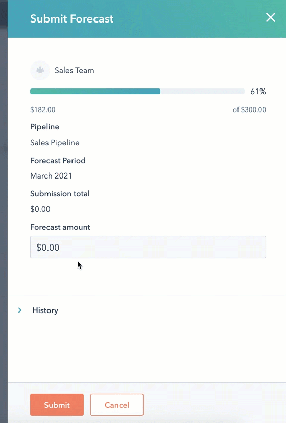

# Forecasting

## Review a forecast 

* In your HubSpot account, navigate to **Sales > Forecast**.
* Users will appear in the forecast tool. Next to their name, you can analyse the following:
  * **Goal attainment**: the closed revenue relevant to the user's revenue goal.
  * **Coverage**: the ratio of all deals forecasted to the revenue goal.
  * **Forecast categories**: monitor the forecasted deal amount in each forecast category.
  * **Forecast submission**: an estimate of how much will be closed in a specific time period.

## Submit a forecast


You have to submit your forecast **every week before the pipeline review**


You can submit a custom forecast for the month or quarter to give your stakeholders an estimate of how much you think you'll close during that time.

* In your HubSpot account, navigate to **Sales > Forecast**.
* At the top, click the Close date dropdown menu and select the month, quarter, or year you want to forecast. To edit the Forecast submission column, the time period you select must match your forecast period (e.g. select Last Month, This Month, or Next Month if your forecast period is set to monthly).
* In the Forecast submission column, click the pencil icon next to the user or team you want to submit a custom forecast for.
* In the right panel, enter an amount in the Forecast **amount field**.
* To track your history of forecast submissions, click History to expand the section.
* When you're ready to submit your forecast, click **Submit**.

