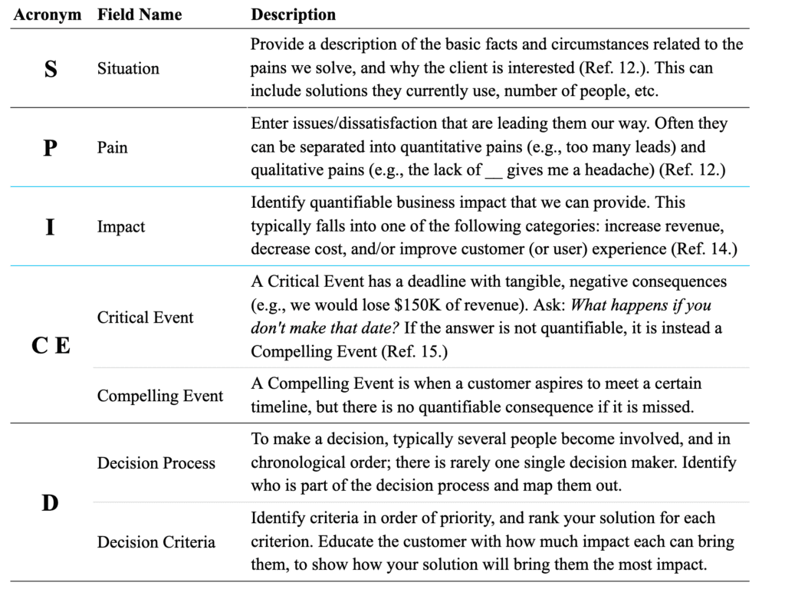

# Deal Qualification


Best transactional sales qualification process that can be done under 5 min.&#x20;


## Situation

Start off with situational questions that show you have done some research, but also help you qualify the customer on basic minimal requirements.

## Pain

When you begin asking pain questions — don’t just ask the generic and over-used “what keeps you up at night?” Instead ask more thoughtful “When speaking to other Engineering managers, they mention challenges 1, 2 and 3 are on their top priorities to solve. To what extent is \[customer challenge #1] important to you?”

Summarize what you’ve heard before moving forward. This demonstrates you’re actively listening, and actually care about the customer.

## 3rd Party Reference 

Share a relevant use-case or customer story that pertains to the situation and pain you just summarized.

## Impact 

Begin to transition from emotional to rational decision-making and quantify the value of your solution. Ask them questions that describe the impact a solution like yours could have for the company.

This is where the discovery call helps you close deals — the ROI is found in the value-based open-ended questions.

## Critical Event

What is driving the urgency?&#x20;

## Decision Process

What are the steps to get you there?&#x20;

 
