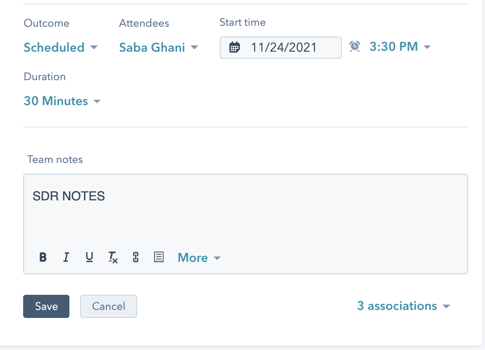

# SDR > AE Handoff

**How we qualify prospects**

Two ways: by email or by call.

Goal: to qualify the opportunity and remove as much friction as possible. We do not want to add steps to the sales process/sales experience just to say we qualified a prospect. If we can qualify them and pass them to an AE without speaking to them, that's fine as well.

**What is a qualified opportunity**

_Potential Enterprise deals or deals that can grow into an Enterprise account._

50+ employees (Find this by researching the company on LinkedIn)

They have a compelling event. (Do they existing docs on their website? Are they building documentation that you can see from SN10 or Amplitude? Have they mentioned a reason they are evaluating GitBook to you?)

High Product Usage (if they are using GitBook heavily, building lots of docs)

_Some examples include_

* Need to create an internal knowledge base
* Sharing documents securely (visitor authentication)
* Want to consolidate and migrate over all their documentation in one place
* Starting to build out documentation now
* They use a competitor like Notion and it doesn’t work for them cause they need something for technical teams/technical documentation.
* They use Confluence, ReadMe, Archbee, Document360, Docusaurus or other direct competitors.

Pass directly to an AE if:

* Number of needed users is above 15
* Need any enterprise features, SAML SSO or Visitor Authentication (even if they say they only need 5+ users or they're smaller <50 people company)
* If they ask for Enterprise pricing or Invoicing.

(If you're not sure, ask an AE if you should pass it or do a call with the prospect as an SDR to make sure)

Some qualification question ideas for SDRs to ask:

* How many users will you have using GitBook internally? Reader, Editor and Admin access. (not external readers).
* What is your use case? What type of documentation are you trying to build/create or migrate?

**SDR > AE Handoff**

1. Hubspot CRM

SDR responsibilities

Change Contact's **Lifecycle Stage** property to: Sales qualified opportunity

Change Meeting Outcome to "Scheduled"

AE responsibilities:

Change Contact's **Lifecycle Stage** property to: Opportunity

.png>)

If demo completed, change Meeting Outcome to "Completed".

.png>)

If demo is a no show, change Meeting Outcome to "No Show."

.png>)

2\. SDR Introduces AE by email

\-email template pending

3\. Set up Zoom meeting / Send Calendly&#x20;

\-meeting template pending

Title: AE name <> Prospect name | GitBook Demo, or GitBook pricing call
