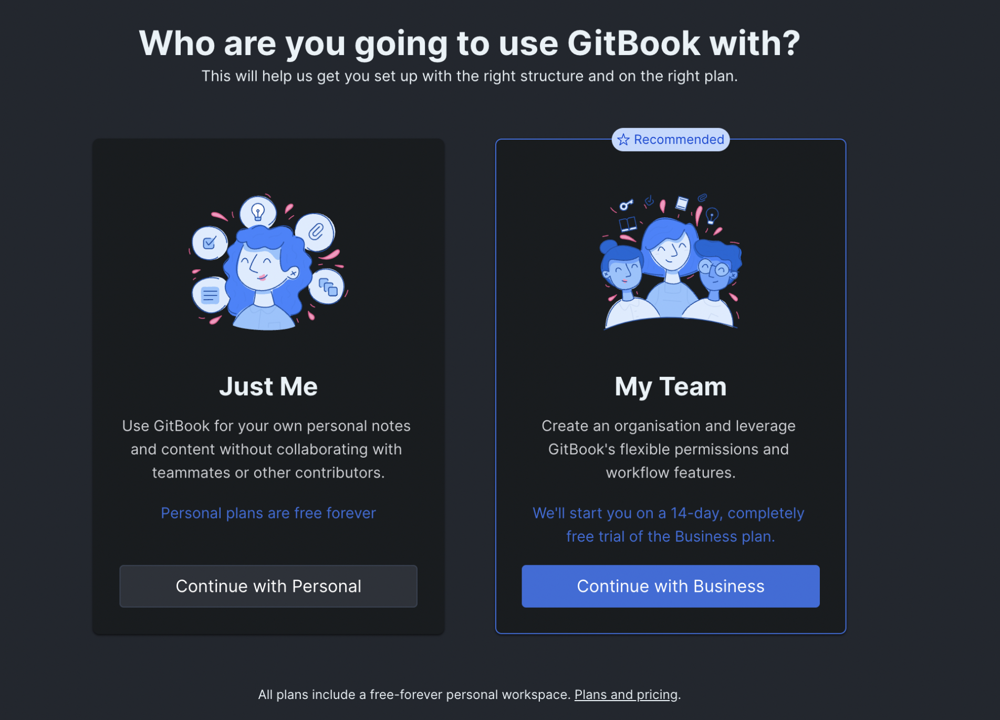

# Triallers Vs Sign-ups

* When someone signs up to GitBook they do so with their email Address, this sends them a magic-link to sign into their account and set it up
* This brings them to the following option: to choose 'Just Me' or 'My Team'

1. 'Just me' creates a **sign-up,** this signs the user up to a personal plan with GitBook, this is a 'personal account'
   * The Free Personal plan offers up to 10 private or public spaces
   * This is good for personal projects but you **cannot** collaborate with anyone else on this plan - it is a one user plan
2. 'My Team' **creates a trialler** - this prompts the user to create an organisation and select why they are using GitBook - IKB, product docs etc

 (1).png>)

* By creating an organisation the user is set up with a 14 day free trial of the business plan and is known in GB as a '**trialler'**
